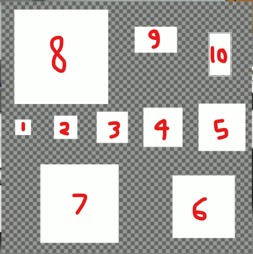
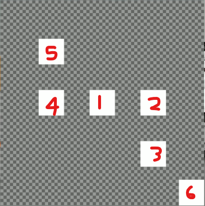
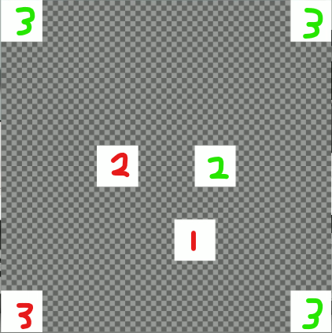

# FRL Code Analysis Documentation

## Overview

FRL (Functional Rendering Language) shapes are positioned on a **signed 16-bit coordinate system** (-32768 to 32767). The format supports efficient shape definitions with built-in mirror modes for instant symmetry without code duplication.

## Hex Structure

Each shape definition is **40 hexadecimal characters** (20 bytes) with the following structure:

``` text
AABBCCCCDDDDEEEEFFFFGGGGHHHHIIJJKKLL
AA BB       = Shape type (0002 = square)
CC CC       = Position X (signed int16)
DD DD       = Position Y (signed int16)
EE EE       = Scale X (signed int16, negative = flip)
FF FF       = Scale Y (signed int16, negative = flip)
GG GG       = Color Red (RR in RRGGBB)
HH HH       = Color Green-Blue (GGBB in RRGGBB)
II          = Opacity/Alpha (00-FF)
JJ JJ       = Blend flags (8 chars reserved)
KK          = Blend selector (01-07)
LL          = Mirror + Visibility combined (01-07 odd=visible, 00-06 even=hidden)
            = Bit pattern: 01/00=no mirror, 03/02=h-mirror, 05/04=v-mirror, 07/06=both
```

### Detailed Field Breakdown

| Field | Hex Offset | Type | Example | Range | Description |
|-------|------------|------|---------|-------|-------------|
| Shape Type | 0–3 | uint16 | `0002` | `0001`–`FFFF` | Shape identifier (0002 = square) |
| Position X | 4–7 | int16 (signed) | `0200`, `FE00` | -32768 to 32767 | X coordinate on canvas |
| Position Y | 8–11 | int16 (signed) | `0200`, `FE00` | -32768 to 32767 | Y coordinate on canvas |
| Scale X | 12–15 | int16 (signed) | `0064`, `FF9C` | -32768 to 32767 | Width with flip (negative = h-flip) |
| Scale Y | 16–19 | int16 (signed) | `0064`, `FF9C` | -32768 to 32767 | Height with flip (negative = v-flip) |
| Color RGB | 20–25 | RRGGBB | `FF0000`, `4390B5` | `000000`–`FFFFFF` | 24-bit color (Red-Green-Blue) |
| Opacity | 26–27 | uint8 | `FF`, `CE` | `00`–`FF` | Alpha transparency (FF = opaque, 00 = transparent) |
| Blend Flags | 28–37 | Hex flags | `FFFFFFFF` | Varies | 8-byte blend mode flags (reserved) |
| Blend Selector | 38–39 | uint8 (last 2 chars) | `01`, `03`, `06` | `00`–`07` | **Visibility & Mirror combined (ODD=visible, EVEN=hidden)**: 01/00=no mirror, 03/02=h-mirror, 05/04=v-mirror, 07/06=both |

## Scale Encoding (Signed 16-bit with Flip)

Scale values represent the width (Scale X) and height (Scale Y) of shapes in pixels. Using **signed 16-bit integers** allows both positive and negative values:

- **Positive values:** Normal scale (1 to 32767 pixels)
- **Negative values:** Flipped scale (same size, but horizontally or vertically flipped)

**Flipping Behavior:**

- **Negative Scale X:** Flips shape horizontally (left-right mirror)
- **Negative Scale Y:** Flips shape vertically (top-bottom mirror)
- **Both negative:** Flips both horizontally and vertically (180° flip)

### Scale Examples (Positive)

Test canvas with 10 squares at varying positive scales:

``` text
FFFF00000000001400140000FFFFFFFF0001
<
    0002FCB10000003200320000FFFFFFFF0001
    0002FE0D0000004B004B0000FFFFFFFF0001
    0002FF880000006400640000FFFFFFFF0001
    000201280000007D007D0000FFFFFFFF0001
    0002030A0000009600960000FFFFFFFF0001
    00020275028500C800C80000FFFFFFFF0001
    0002FE7C026E00FA00FA0000FFFFFFFF0001
    0002FDE9FDC2012C012C0000FFFFFFFF0001
    000200ECFD38008800530000FFFFFFFF0001
    000202F9FDAE004200850000FFFFFFFF0001
>
```

| # | Code | Position X | Position Y | Scale X | Scale Y | Hex Position | Hex Scale | Description |
|---|------|-----------|-----------|---------|---------|---|---|-------------|
| 1 | `0002FCB10000003200320000FFFFFFFF0001` | FCB1 | 0000 | 0032 | 0032 | −847, 0 | 50 × 50 | Small square |
| 2 | `0002FE0D0000004B004B0000FFFFFFFF0001` | FE0D | 0000 | 004B | 004B | −499, 0 | 75 × 75 | Medium-small |
| 3 | `0002FF880000006400640000FFFFFFFF0001` | FF88 | 0000 | 0064 | 0064 | −120, 0 | 100 × 100 | Standard |
| 4 | `000201280000007D007D0000FFFFFFFF0001` | 0128 | 0000 | 007D | 007D | 296, 0 | 125 × 125 | Medium-large |
| 5 | `0002030A0000009600960000FFFFFFFF0001` | 030A | 0000 | 0096 | 0096 | 778, 0 | 150 × 150 | Large |
| 6 | `00020275028500C800C80000FFFFFFFF0001` | 0275 | 0285 | 00C8 | 00C8 | 629, 645 | 200 × 200 | Extra large |
| 7 | `0002FE7C026E00FA00FA0000FFFFFFFF0001` | FE7C | 026E | 00FA | 00FA | −388, 622 | 250 × 250 | Very large |
| 8 | `0002FDE9FDC2012C012C0000FFFFFFFF0001` | FDE9 | FDC2 | 012C | 012C | −535, −574 | 300 × 300 | Huge |
| 9 | `000200ECFD38008800530000FFFFFFFF0001` | 00EC | FD38 | 0088 | 0053 | 236, −712 | 136 × 83 | Custom rectangular |
| 10 | `000202F9FDAE004200850000FFFFFFFF0001` | 02F9 | FDAE | 0042 | 0085 | 761, −594 | 66 × 163 | Custom tall |



### Scale Examples (Negative – Flipping)

Test canvas with same squares at negative scales (flipped):

``` text
FFFF00000000001400140000FFFFFFFF0001
<
    0002FCB10000FFCEFFCE0000FFFFFFFF0001
    0002FE0D0000FFB5FFB50000FFFFFFFF0001
    0002FF880000FF9CFF9C0000FFFFFFFF0001
    000201280000FF83FF830000FFFFFFFF0001
    0002030A0000FF6AFF6A0000FFFFFFFF0001
    000202750285FF38FF380000FFFFFFFF0001
    0002FE7C026EFF06FF060000FFFFFFFF0001
    0002FDE9FDC2FED4FED40000FFFFFFFF0001
    000200ECFD38FF78FFAD0000FFFFFFFF0001
    000202F9FDAEFFBEFF7B0000FFFFFFFF0001
>
```

| # | Code | Scale X (Hex) | Scale Y (Hex) | Positive | Negative | Effect |
|---|------|---|---|---|---|-------------|
| 1 | `0002FCB10000FFCEFFCE0000FFFFFFFF0001` | FFCE | FFCE | 50 | -50 | H-flip & V-flip 50×50 |
| 2 | `0002FE0D0000FFB5FFB50000FFFFFFFF0001` | FFB5 | FFB5 | 75 | -75 | H-flip & V-flip 75×75 |
| 3 | `0002FF880000FF9CFF9C0000FFFFFFFF0001` | FF9C | FF9C | 100 | -100 | H-flip & V-flip 100×100 |
| 4 | `000201280000FF83FF830000FFFFFFFF0001` | FF83 | FF83 | 125 | -125 | H-flip & V-flip 125×125 |
| 5 | `0002030A0000FF6AFF6A0000FFFFFFFF0001` | FF6A | FF6A | 150 | -150 | H-flip & V-flip 150×150 |
| 6 | `000202750285FF38FF380000FFFFFFFF0001` | FF38 | FF38 | 200 | -200 | H-flip & V-flip 200×200 |
| 7 | `0002FE7C026EFF06FF060000FFFFFFFF0001` | FF06 | FF06 | 250 | -250 | H-flip & V-flip 250×250 |
| 8 | `0002FDE9FDC2FED4FED40000FFFFFFFF0001` | FED4 | FED4 | 300 | -300 | H-flip & V-flip 300×300 |
| 9 | `000200ECFD38FF78FFAD0000FFFFFFFF0001` | FF78 | FFAD | 136 | -136 | H-flip 136, V-flip -83 |
| 10 | `000202F9FDAEFFBEFF7B0000FFFFFFFF0001` | FFBE | FF7B | 66 | -66 | H-flip 66, V-flip -123 |

**Negative Scale Encoding:**

| Size | Positive Hex | Decimal | Negative Hex | Signed int16 | Visual Effect |
|------|---|---|---|---|---|
| 50 | `0032` | 50 | `FFCE` | -50 | Flipped horizontally & vertically |
| 100 | `0064` | 100 | `FF9C` | -100 | Flipped horizontally & vertically |
| 150 | `0096` | 150 | `FF6A` | -150 | Flipped horizontally & vertically |
| 300 | `012C` | 300 | `FED4` | -300 | Flipped horizontally & vertically |

Positions use **signed 16-bit integers**, supporting both positive and negative coordinates:

| Hex Value | Decimal | Description |
|-----------|---------|-------------|
| `0x0000` | 0 | Center origin |
| `0x00B0` | 176 | Small right/down offset |
| `0x0200` | 512 | Standard right/down |
| `0x0380` | 896 | Large right/down |
| `0xFED1` | -303 | Small left/up (negative) |
| `0xFE00` | -512 | Standard left/up |
| `0xFC80` | -896 | Large left/up |

### Position Examples

Test canvas with 6 squares at different positions:

``` text
FFFF00000000001400140000FFFFFFFF0001
<
    000200000000006400640000FFFFFFFF0001
    000202000000006400640000FFFFFFFF0001
    000202000200006400640000FFFFFFFF0001
    0002FE000000006400640000FFFFFFFF0001
    0002FE00FE00006400640000FFFFFFFF0001
    000203800380006400640000FFFFFFFF0001
>
```

| # | Code | Pos X | Pos Y | Hex Position | Scale | Description |
|---|------|-------|-------|---|-------|-------------|
| 1 | `000200000000006400640000FFFFFFFF0001` | 0000 | 0000 | 0, 0 | 100×100 | Center square |
| 2 | `000202000000006400640000FFFFFFFF0001` | 0200 | 0000 | 512, 0 | 100×100 | Right of center |
| 3 | `000202000200006400640000FFFFFFFF0001` | 0200 | 0200 | 512, 512 | 100×100 | Bottom-right |
| 4 | `0002FE000000006400640000FFFFFFFF0001` | FE00 | 0000 | −512, 0 | 100×100 | Left of center |
| 5 | `0002FE00FE00006400640000FFFFFFFF0001` | FE00 | FE00 | −512, −512 | 100×100 | Top-left |
| 6 | `000203800380006400640000FFFFFFFF0001` | 0380 | 0380 | 896, 896 | 100×100 | Bottom-right corner |

**Position Encoding Breakdown (Line 1):**

- Hex: `000200000000006400640000FFFFFFFF0001`
- Shape: `0002` (square)
- Position X: `0000` = 0
- Position Y: `0000` = 0
- Scale X: `0064` = 100
- Scale Y: `0064` = 100
- Color: `000000` (white, rendered with color encoding)
- Opacity/Flags: `FFFFFFFF` (full opacity)
- Mirror: `0001` (none)

Result: White square at origin (0, 0), size 100×100



## Mirror Modes

Mirrors duplicate shapes with automatic symmetry, reducing file size significantly. Defined by the **last 4 hex characters**:

| Code | Mirror Type | Total Shapes | Effect |
|------|-------------|--------------|--------|
| `0001` | None | 1 | Single shape at defined position |
| `0003` | Horizontal | 2 | Original + left-right mirror |
| `0005` | Vertical | 2 | Original + top-bottom mirror |
| `0007` | Both (H+V) | 4 | All 4 quadrants (full symmetry) |

### Mirror Test Examples

**Test Canvas:**

``` text
FFFF00000000001400140000FFFFFFFF0001
<
    000200B001CA006400640000FFFFFFFF0001
    0002FED10000006400640000FFFFFFFF0003
    0002FC800380006400640000FFFFFFFF0007
>
```

| Example | Code | Position | Mirror | Shapes | Description |
|---------|------|----------|--------|--------|-------------|
| 1 (Red #1) | `000200B001CA006400640000FFFFFFFF0001` | (176, 458) | 0001 (none) | 1 | Single square at offset position |
| 2 (Red #3, Green #3) | `0002FED10000006400640000FFFFFFFF0003` | (-303, 0) | 0003 (H) | 2 | Pair centered horizontally |
| 3 (Red #1–4, Green #3) | `0002FC800380006400640000FFFFFFFF0007` | (-896, 896) | 0007 (H+V) | 4 | All 4 corners with full symmetry |



## Group/Canvas Structure

Shapes are typically wrapped in a **group (canvas)** element for organization and coordinate system containment:

``` text
FFFF00000000001400140000FFFFFFFF0001
<
    000200000000006400640000FFFFFFFF0001
    000202000000006400640000FFFFFFFF0001
    000202000200006400640000FFFFFFFF0001
    0002FE000000006400640000FFFFFFFF0001
    0002FE00FE00006400640000FFFFFFFF0001
    000203800380006400640000FFFFFFFF0001
>
```

**Group Header:** `FFFF00000000001400140000FFFFFFFF0001`

- Type: `FFFF` (group)
- Position: (0, 0)
- Scale: (20, 20)
- All shapes inside inherit and render relative to canvas properties

**Contained Shapes:**

| # | Code | Position | Size | Notes |
|---|------|----------|------|-------|
| 1 | `000200000000006400640000FFFFFFFF0001` | (0, 0) | 100×100 | Center square |
| 2 | `000202000000006400640000FFFFFFFF0001` | (512, 0) | 100×100 | Right of center |
| 3 | `000202000200006400640000FFFFFFFF0001` | (512, 512) | 100×100 | Bottom-right |
| 4 | `0002FE000000006400640000FFFFFFFF0001` | (-512, 0) | 100×100 | Left of center |
| 5 | `0002FE00FE00006400640000FFFFFFFF0001` | (-512, -512) | 100×100 | Top-left |
| 6 | `000203800380006400640000FFFFFFFF0001` | (896, 896) | 100×100 | Bottom-right corner |

## Efficiency: Mirrors vs. Duplication

Using mirror modes significantly reduces file size and simplifies design:

### Without Mirrors (Verbose)

``` text
0002FED10000006400640000FFFFFFFF0001
0002FED10000006400640000FFFFFFFF0001
```

- File size: 80 hex characters (40 bytes)
- Result: 2 identical shapes at (-303, 0)

### With Mirrors (Efficient)

``` text
0002FED10000006400640000FFFFFFFF0003
```

- File size: 40 hex characters (20 bytes)
- Result: 2 shapes with automatic left-right symmetry

**Savings:** 50% reduction while maintaining identical visual output

## Quick Reference

| Scenario | Position | Mirror | Hex Code | Shapes |
|----------|----------|--------|----------|--------|
| Single center | (0, 0) | `0001` | `000200000000006400640000FFFFFFFF0001` | 1 |
| Offset single | (176, 458) | `0001` | `000200B001CA006400640000FFFFFFFF0001` | 1 |
| H-symmetric pair | (-303, 0) | `0003` | `0002FED10000006400640000FFFFFFFF0003` | 2 |
| V-symmetric pair | (0, -256) | `0005` | `0002000FFE00006400640000FFFFFFFF0005` | 2 |
| 4-way symmetric | (-896, 896) | `0007` | `0002FC800380006400640000FFFFFFFF0007` | 4 |

## Rotation

Rotation is stored as a **16-bit signed integer** (int16, range -32768 to 32767) in the color field (bytes 20–23). Values represent degrees directly, with automatic wrap-around for values outside 0–359°.

**Key Properties:**

- **Encoding:** Signed 16-bit integer (int16)
- **Range:** -32768 to 32767 degrees
- **Wrap-around:** Values normalize to 0–359° (e.g., -286° → 74°, 816° → 96°)
- **Direct mapping:** Hex value converts directly to degrees (no scaling formula)

**Normalization Formula:**

``` text
Final_Rotation = Rotation_Value mod 360
If negative: Final_Rotation = Rotation_Value + 360
```

### Rotation Encoding

| Rotation | Hex Value | Decimal | Signed Int16 | Normalized | Description |
|----------|-----------|---------|---|---|-------------|
| 0° | `0000` | 0 | 0 | 0° | No rotation |
| 45° | `002D` | 45 | 45 | 45° | Direct degree mapping |
| 56° | `0038` | 56 | 56 | 56° | Direct degree mapping |
| 74° | `004A` | 74 | 74 | 74° | Direct degree mapping |
| 90° | `005A` | 90 | 90 | 90° | Direct degree mapping |
| 137° | `0089` | 137 | 137 | 137° | Direct degree mapping |
| 180° | `00B4` | 180 | 180 | 180° | Direct degree mapping |
| -286° | `FEE2` | 65250 | -286 | 74° | Negative wrap-around (360-286) |
| 816° | `0330` | 816 | 816 | 96° | Positive wrap-around (816 mod 360) |

### Rotation Examples

Test canvas with rotated squares and rectangles:

``` text
FFFF00000000001400140000FFFFFFFF0001
<
    0002FCD70000006400640000FFFFFFFF0001
    0002FE69000000640064002DFFFFFFFF0001
    00020005000000640064005AFFFFFFFF0001
    0002FD3E021F008F00480000FFFFFFFF0001
    0002FD59031F008F004800B4FFFFFFFF0001
    0002FF8801D4008F00480038FFFFFFFF0001
    0002014901B6008F00480089FFFFFFFF0001
>
```

| # | Code | Pos X,Y | Scale | Rotation (Hex) | Rotation (Dec) | Description |
|---|------|---------|-------|---|---|-------------|
| 1 | `0002FCD70000006400640000FFFFFFFF0001` | −809, 0 | 100×100 | 0000 | 0° | Square, no rotation |
| 2 | `0002FE69000000640064002DFFFFFFFF0001` | −407, 0 | 100×100 | 002D | 45° | Square rotated 45° |
| 3 | `00020005000000640064005AFFFFFFFF0001` | 5, 0 | 100×100 | 005A | 90° | Square rotated 90° |
| 4 | `0002FD3E021F008F00480000FFFFFFFF0001` | −706, 543 | 143×72 | 0000 | 0° | Rectangle, no rotation |
| 5 | `0002FD59031F008F004800B4FFFFFFFF0001` | −679, 799 | 143×72 | 00B4 | 180° | Rectangle rotated 180° |
| 6 | `0002FF8801D4008F00480038FFFFFFFF0001` | −120, 468 | 143×72 | 0038 | 56° | Rectangle rotated 56° |
| 7 | `0002014901B6008F00480089FFFFFFFF0001` | 329, 438 | 143×72 | 0089 | 137° | Rectangle rotated 137° |
| 8 | `0002014901B6008F0048FEE2FFFFFFFF0001` | 329, 438 | 143×72 | FEE2 | -286° (→ 74°) | Rectangle with negative rotation |

**Rotation Decoding Example (Row 7 – Positive Rotation):**

- Hex: `0002014901B6008F00480089FFFFFFFF0001`
- Position X: `0149` = 329
- Position Y: `01B6` = 438
- Scale X: `008F` = 143
- Scale Y: `0048` = 72
- **Rotation: `0089` = 137°**
- Opacity/Flags: `FFFFFFFF`
- Mirror: `0001` (none)

Result: White rectangle at (329, 438), size 143×72, rotated 137°

**Rotation Decoding Example (Row 8 – Negative Rotation):**

- Hex: `0002014901B6008F0048FEE2FFFFFFFF0001`
- Position X: `0149` = 329
- Position Y: `01B6` = 438
- Scale X: `008F` = 143
- Scale Y: `0048` = 72
- **Rotation: `FEE2` = -286° (signed int16)**
- **Normalized: -286° + 360° = 74°**
- Opacity/Flags: `FFFFFFFF`
- Mirror: `0001` (none)

Result: White rectangle at (329, 438), size 143×72, rotated -286° (visually equivalent to 74°)


**Encoding Notes:**

- **Positive rotations:** Stored directly (0–32767°, normalized to 0–359°)
- **Negative rotations:** Stored as signed int16 (-32768 to -1°), normalized to equivalent positive angles
- **Wrap-around:** All values automatically normalize to 0–359° range during rendering

## Color Format

Colors use **24-bit RGB** in hexadecimal (RRGGBB) stored in bytes 20–25. All 16.7 million colors are supported.

### Color Examples

| Color | Hex Value | Description |
|-------|-----------|-------------|
| Red | `FF0000` | Full red (255, 0, 0) |
| Green | `00FF00` | Full green (0, 255, 0) |
| Blue | `0000FF` | Full blue (0, 0, 255) |
| Yellow | `FFFF00` | Red + Green (255, 255, 0) |
| Cyan | `00FFFF` | Green + Blue (0, 255, 255) |
| Magenta/Pink | `FF00FF` | Red + Blue (255, 0, 255) |
| White | `FFFFFF` | All colors (255, 255, 255) |
| Black | `000000` | No color (0, 0, 0) |
| Custom | `4390B5` | Teal blue example |

### Color Test Canvas

Test canvas with 9 colored squares:

``` text
FFFF00000000001400140000FFFFFFFF0001
<
    0002FE000000006400640000FF0000FF0001
    00020000000000640064000000FF00FF0001
    0002020000000064006400000000FFFF0001
    0002FE00FE00006400640000FFFF00FF0001
    00020000FE00006400640000FF00FFFF0001
    00020200FE0000640064000000FFFFFF0001
    0002FE0002000064006400004390B5FF0001
    000200000200006400640000963776CE0001
    000202000200006400640000BAB2894B0001
>
```

| # | Code | Color Hex | Color Name | Opacity | Description |
|---|------|---|---|---|-------------|
| 1 | `0002FE000000006400640000FF0000FF0001` | FF0000 | Red | FF (100%) | Full red, fully opaque |
| 2 | `00020000000000640064000000FF00FF0001` | 00FF00 | Green | FF (100%) | Full green, fully opaque |
| 3 | `0002020000000064006400000000FFFF0001` | 0000FF | Blue | FF (100%) | Full blue, fully opaque |
| 4 | `0002FE00FE00006400640000FFFF00FF0001` | FFFF00 | Yellow | FF (100%) | Red + Green, fully opaque |
| 5 | `00020000FE00006400640000FF00FFFF0001` | FF00FF | Magenta | FF (100%) | Red + Blue, fully opaque |
| 6 | `00020200FE0000640064000000FFFFFF0001` | 00FFFF | Cyan | FF (100%) | Green + Blue, fully opaque |
| 7 | `0002FE0002000064006400004390B5FF0001` | 4390B5 | Teal | FF (100%) | Custom color, fully opaque |
| 8 | `000200000200006400640000963776CE0001` | 963776 | Mauve | CE (~80%) | Custom color, 206/255 opacity |
| 9 | `000202000200006400640000BAB2894B0001` | BAB289 | Tan | 4B (~29%) | Custom color, 75/255 opacity |

**Color Decoding Example (Row 1 – Red):**

- Hex: `0002FE000000006400640000FF0000FF0001`
- Position X: `FE00` = -512
- Position Y: `0000` = 0
- Scale X: `0064` = 100
- Scale Y: `0064` = 100
- **Color: `FF0000` = Red (255, 0, 0)**
- **Opacity: `FF` = 255 (100%)**
- **Blend: `FFFFFF` = Normal**
- Mirror: `0001` (none)

Result: Red square at (-512, 0), size 100×100, fully opaque, normal blend

## Opacity

Opacity (alpha transparency) is stored as an **unsigned 8-bit integer** (bytes 26–27, one byte) with values from 0–255.

**Opacity Values:**

| Opacity | Hex | Decimal | Percentage | Description |
|---------|-----|---------|------------|-------------|
| Transparent | `00` | 0 | 0% | Fully transparent (invisible) |
| 25% | `40` | 64 | 25% | Mostly transparent |
| 50% | `80` | 128 | 50% | Semi-transparent |
| 75% | `BF` | 191 | 75% | Mostly opaque |
| ~80% | `CE` | 206 | 81% | Custom opacity |
| ~29% | `4B` | 75 | 29% | Custom opacity |
| Opaque | `FF` | 255 | 100% | Fully opaque (no transparency) |

### Opacity Test Examples

**Test canvas with 3 colored squares at different opacity levels:**

``` text
0002FE000000006400640000FF0000FF0001    (Red, opacity FF = 100%)
000200000200006400640000963776CE0001    (Mauve, opacity CE = 206 = ~80%)
000202000200006400640000BAB2894B0001    (Tan, opacity 4B = 75 = ~29%)
```

| Shape | Color | Opacity Hex | Opacity Dec | Percentage | Visual Effect |
|-------|-------|---|---|---|---|
| Red | FF0000 | FF | 255 | 100% | Fully opaque, no transparency |
| Mauve | 963776 | CE | 206 | ~81% | Mostly opaque with slight transparency |
| Tan | BAB289 | 4B | 75 | ~29% | Mostly transparent, faint color |

**Opacity Encoding Formula:**

``` text
Opacity_Percentage = (Opacity_Hex / 255) × 100
Opacity_Hex = (Opacity_Percentage / 100) × 255
```

---

## Visibility & Mirror Combined Encoding

Shape visibility and mirror modes are **elegantly combined in a single byte** (the last character of the 40-character code) using an **odd/even bit-pattern encoding**. This unified approach encodes three properties in one hex digit:

**Key Properties:**

- **Encoding:** Single hex digit (0–7) with 3-bit pattern
  - **Bit 0 (LSB):** Visibility (1 = visible, 0 = hidden)
  - **Bit 1:** V-mirror flag (1 = v-mirror enabled)
  - **Bit 2:** H-mirror flag (1 = h-mirror enabled)
- **Visibility pattern:** ODD values (1, 3, 5, 7) = visible, EVEN values (0, 2, 4, 6) = hidden
- **Mirror independence:** Mirrors apply and create duplicates even when shape is hidden
- **Use cases:**
  - Visible shapes with mirrors for symmetrical designs
  - Hidden mirrored shapes for layout scaffolding/guides (invisible but calculated)

### Mirror + Visibility Bit Pattern Table

| Value | Hex | Binary | Visibility | H-Mirror | V-Mirror | Total Instances | Description |
|-------|-----|--------|-----------|----------|----------|---------|-------------|
| 0 | `00` | 000 | ❌ Hidden | ❌ No | ❌ No | 1 | Single hidden shape |
| 1 | `01` | 001 | ✅ Visible | ❌ No | ❌ No | 1 | Single visible shape |
| 2 | `02` | 010 | ❌ Hidden | ✅ Yes | ❌ No | 2 | Two hidden h-mirrored instances |
| 3 | `03` | 011 | ✅ Visible | ✅ Yes | ❌ No | 2 | Two visible h-mirrored instances |
| 4 | `04` | 100 | ❌ Hidden | ❌ No | ✅ Yes | 2 | Two hidden v-mirrored instances |
| 5 | `05` | 101 | ✅ Visible | ❌ No | ✅ Yes | 2 | Two visible v-mirrored instances |
| 6 | `06` | 110 | ❌ Hidden | ✅ Yes | ✅ Yes | 4 | Four hidden fully-mirrored instances |
| 7 | `07` | 111 | ✅ Visible | ✅ Yes | ✅ Yes | 4 | Four visible fully-mirrored instances |

### Visibility & Mirror Test Canvas

Test canvas demonstrating all 8 combinations with the same position and size:

``` text
FFFF00000000006400640000FFFFFFFF0001
<
    0002FE000000006400640000FFFFFFFF0001
    0002FE000000006400640000FFFFFFFF0000
    0002FE000000006400640000FFFFFFFF0003
    0002FE000000006400640000FFFFFFFF0002
    0002FE000000006400640000FFFFFFFF0005
    0002FE000000006400640000FFFFFFFF0004
    0002FE000000006400640000FFFFFFFF0007
    0002FE000000006400640000FFFFFFFF0006
>
```

| # | Hex Code | Last Char | Visibility | Mirror | Total Shapes | Visual Result |
|---|---|---|---|---|---|---|
| 1 | `...FFFFFFFF0001` | `01` | ✅ Visible | None | 1 | 1 white square at (-512, 0) |
| 2 | `...FFFFFFFF0000` | `00` | ❌ Hidden | None | 1 | No rendering (1 hidden shape) |
| 3 | `...FFFFFFFF0003` | `03` | ✅ Visible | H-mirror | 2 | 2 visible white squares (h-mirrored pair) |
| 4 | `...FFFFFFFF0002` | `02` | ❌ Hidden | H-mirror | 2 | No rendering (2 h-mirrored hidden shapes) |
| 5 | `...FFFFFFFF0005` | `05` | ✅ Visible | V-mirror | 2 | 2 visible white squares (v-mirrored pair) |
| 6 | `...FFFFFFFF0004` | `04` | ❌ Hidden | V-mirror | 2 | No rendering (2 v-mirrored hidden shapes) |
| 7 | `...FFFFFFFF0007` | `07` | ✅ Visible | Both | 4 | 4 visible white squares (full 4-way symmetry) |
| 8 | `...FFFFFFFF0006` | `06` | ❌ Hidden | Both | 4 | No rendering (4 fully-mirrored hidden shapes) |

### Encoding Logic Examples

#### Example 1: Visible, No Mirror (01)

- Hex: `0002FE000000006400640000FFFFFFFF0001`
- Last char: `01` (binary 001)
  - Bit 0 = 1 → **VISIBLE**
  - Bit 1 = 0 → No V-mirror
  - Bit 2 = 0 → No H-mirror
- Result: **1 visible shape** at (-512, 0), 100×100, white

#### Example 2: Visible, H-Mirror Only (03)

- Hex: `0002FE000000006400640000FFFFFFFF0003`
- Last char: `03` (binary 011)
  - Bit 0 = 1 → **VISIBLE**
  - Bit 1 = 1 → **H-mirror enabled**
  - Bit 2 = 0 → No V-mirror
- Result: **2 visible shapes** at (-512, 0) with h-mirror symmetry (original + left-right mirror)

#### Example 3: Visible, Both Mirrors (07)

- Hex: `0002FE000000006400640000FFFFFFFF0007`
- Last char: `07` (binary 111)
  - Bit 0 = 1 → **VISIBLE**
  - Bit 1 = 1 → **H-mirror enabled**
  - Bit 2 = 1 → **V-mirror enabled**
- Result: **4 visible shapes** at (-512, 0) with full 4-way symmetry (all quadrants)

#### Example 4: Hidden, Both Mirrors (06)

- Hex: `0002FE79FEDF006400640000FFFFFFFF0006`
- Last char: `06` (binary 110)
  - Bit 0 = 0 → **HIDDEN**
  - Bit 1 = 1 → **H-mirror enabled**
  - Bit 2 = 1 → **V-mirror enabled**
- Result: **4 hidden shapes** (not rendered, but 4 mirrored instances calculated)
- **Use case:** Layout scaffolding, invisible guide shapes for alignment

### Why This Encoding is Elegant

1. **Single byte encodes 3 independent properties:** Visibility + H-mirror + V-mirror
2. **Binary bit logic:** Each mirror axis is a separate bit, allowing all 8 combinations
3. **Natural odd/even pattern:** Visibility determined by LSB (bit 0)
4. **Space efficient:** Uses only 1 hex character instead of separate fields
5. **Mirrors work even when hidden:** Enables invisible guide shapes and layout scaffolding

### Field Location

The visibility and mirror encoding occupies the **last character** of the 40-character code:

``` text
AABBCCCCDDDDEEEEFFFFGGGGHHHHIIJJKKLL
                                    LL ← Mirror + Visibility (00-07)
                                      = Binary: HH VV V (H=h-mirror, V=v-mirror, V=visibility)
                                      
01 = 0b001 = visible, no mirrors
03 = 0b011 = visible, h-mirror
05 = 0b101 = visible, v-mirror
07 = 0b111 = visible, both mirrors
00 = 0b000 = hidden, no mirrors
02 = 0b010 = hidden, h-mirror
04 = 0b100 = hidden, v-mirror
06 = 0b110 = hidden, both mirrors
```

### Visual Comparison: Visible vs Hidden Mirrors

| Scenario | Code Ending | Visual | Hidden Benefit |
|----------|------------|--------|---|
| **Visible Pair (H-mirror)** | `0003` | ✅ 2 shapes shown | — |
| **Hidden Pair (H-mirror)** | `0002` | ❌ 0 shapes shown | Invisible guides at mirrored positions |
| **Visible 4-way (Both)** | `0007` | ✅ 4 shapes shown | Full visual symmetry |
| **Hidden 4-way (Both)** | `0006` | ❌ 0 shapes shown | Invisible scaffolding in all quadrants |

This design allows designers to create invisible structural guides and helper shapes that maintain mirror relationships without cluttering the visual output.

---

## Blend Mode

Blend mode is stored as a **single hex digit** (bytes 38–39, second to last character of the final field) that controls how the shape composites with the background/underlying layers.

**Blend Mode Encoding:**

| Mode # | Hex | Blend Mode | Description |
|--------|-----|-----------|-------------|
| 0 | `01` | Normal | Standard alpha blending (default) |
| 1 | `0101` | Add | Additive blend (brightens background) |
| 2 | `0201` | Soft Add | Additive blend with reduced intensity |
| 3 | `0301` | Multiple | Multiplicative blend (darkens background) |
| 4 | `0401` | 2x Multiple | Doubled multiplicative blend (stronger darkening) |
| 5 | `0501` | Lighter | Keeps lighter pixels (max of RGB values) |
| 6 | `0601` | Darker | Keeps darker pixels (min of RGB values) |
| 7 | `0701` | Replace | Completely replaces background (ignores alpha) |

### Blend Mode Test Canvas

Test canvas with 8 white squares at different blend modes:

``` text
FFFF00000000001400140000FFFFFFFF0001
<
    0002FC990352006400640000FFFFFFFF0001
    0002FDB30352006400640000FFFFFFFF0101
    0002FEC00352006400640000FFFFFFFF0201
    0002FFDE0352006400640000FFFFFFFF0301
    000200F90352006400640000FFFFFFFF0401
    000202170352006400640000FFFFFFFF0501
    000203520352006400640000FFFFFFFF0601
    00020352021D006400640000FFFFFFFF0701
>
```

| # | Blend Mode | Hex Code | Last 4 Chars | Visual Effect |
|---|---|---|---|---|
| 1 | Normal | 0001 | `0001` | Standard blending, respects alpha |
| 2 | Add | 0101 | `0101` | Additive: brightens by adding RGB values |
| 3 | Soft Add | 0201 | `0201` | Additive with reduced intensity |
| 4 | Multiple | 0301 | `0301` | Multiplicative: darkens by multiplying RGB |
| 5 | 2x Multiple | 0401 | `0401` | Doubled multiplicative: very dark effect |
| 6 | Lighter | 0501 | `0501` | Keeps lighter color per channel |
| 7 | Darker | 0601 | `0601` | Keeps darker color per channel |
| 8 | Replace | 0701 | `0701` | Replaces background completely (no alpha) |

**Blend Mode Field Location:**

The blend mode selector occupies the **second-to-last character** of the 40-character code, while the **last character** encodes **both mirror mode and visibility**:

``` text
AABBCCCCDDDDEEEEFFFFGGGGHHHHIIJJKKLL
                              KK    ← Blend selector (01-07, first char)
                                LL  ← Mirror + Visibility combined
                                     (01/03/05/07 = visible)
                                     (00/02/04/06 = hidden)
```

**Character Breakdown (positions 38–39, last 2 chars):**

- **Char 38 (K):** Blend selector (0-7 determining blend mode: 0=normal, 1=add, 2=soft add, etc.)
- **Char 39 (L):** Mirror + Visibility (0-7 using odd/even and bit patterns)

### Example: Normal Blend, Visible, No Mirror (01)

- Full code: `0002FE000000006400640000FFFFFFFF0001`
- Last 2 chars: `01`
  - Char 38: `0` = Normal blend (0)
  - Char 39: `1` = ODD (visible), no mirror bits
- Result: White square, normal blend, visible, no mirror

### Example: Add Blend, Visible, No Mirror (1 + 01)

- Full code: `0002FDB30352006400640000FFFFFFFF0101`
- Last 2 chars: `01`
  - Char 38: `0` = Add blend (1) prefix
  - Char 39: `1` = ODD (visible), no mirror bits
- Result: White square, add blend, visible, no mirror

### Example: Normal Blend, Hidden, Both Mirrors (00 + 06)

- Full code: `0002FE79FEDF006400640000FFFFFFFF0006`
- Last 2 chars: `06`
  - Char 38: `0` = Normal blend
  - Char 39: `6` = EVEN (hidden), both mirror bits set
- Result: 4 hidden mirrored instances (not rendered, but mirror calculation applied)

---

## Best Practices

1. **Use mirrors for symmetry** — Reduces file size by 50–75% while maintaining visual accuracy
2. **Position from center** — Leverages natural symmetry of designs and simplifies coordinate calculations
3. **Group related shapes** — Improves organization, rendering efficiency, and readability
4. **Standardize offsets** — Use common values (512, 896) to maintain consistency
5. **Test scale ranges** — Validate that shapes render correctly at 50–300+ pixel dimensions
6. **Combine position + scale** — Position determines placement; scale determines size
